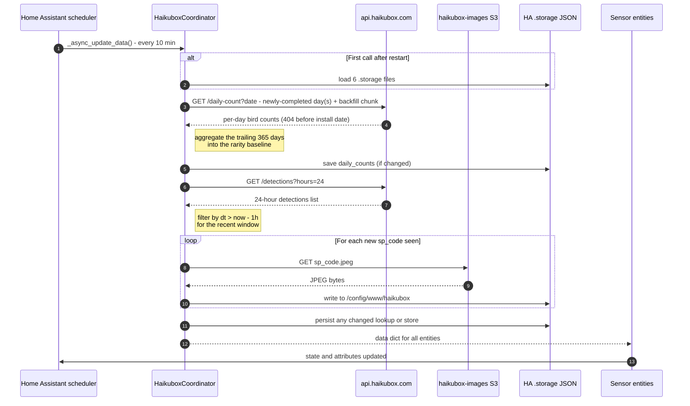

# Haikubox API interactions

This page documents every network call the integration makes — the endpoints it hits, when, with what parameters, and what it does with the responses. It's intended as a reference for anyone debugging API behaviour, planning rate-limit budgets, or reasoning about offline resilience.

The integration is a one-way **cloud_polling** consumer: it reads from the public Haikubox API and the Haikubox image S3 bucket. It never writes back to the Haikubox cloud.

## Endpoints at a glance

| Endpoint | When called | Auth | Response shape |
|---|---|---|---|
| `GET https://api.haikubox.com/haikubox/<serial>` | Config flow (initial setup + reconfigure) | None | `{ "haikuboxName": "<name>", … }` |
| `GET https://api.haikubox.com/haikubox/<serial>/detections?hours=24` | Every poll, once | None | `{ "detections": [ {cn, sn, spCode, dt}, … ] }` |
| `GET https://api.haikubox.com/haikubox/<serial>/daily-count?date=<YYYY-MM-DD>` | Newly-completed days each poll + a throttled one-time historical backfill | None | `[ { "bird": "<name>", "count": <int> }, … ]` (`404` for dates before the box was installed) |
| `GET https://haikubox-images.s3.amazonaws.com/<sp_code>.jpeg` | Once per species, lazily | None | Binary JPEG |

All requests use Home Assistant's shared `aiohttp` session via `async_get_clientsession(hass)`. No authentication headers are sent; the serial number in the URL path is the only access token the integration provides.

Source: [`const.py`](../custom_components/haikubox/const.py) for base URLs and intervals; [`coordinator.py`](../custom_components/haikubox/coordinator.py) for poll loop; [`config_flow.py`](../custom_components/haikubox/config_flow.py) for setup; [`image_cache.py`](../custom_components/haikubox/image_cache.py) for image fetching.

## One poll cycle

Every call is made **sequentially** today — each `await` waits for the previous one. The daily-count and `/detections` calls could be parallelised with `asyncio.gather`; they aren't, because the Haikubox API's responsiveness has never made it worth the complexity. Backfill requests are also deliberately spaced (a small `BACKFILL_REQUEST_DELAY` between them) so a fresh install doesn't burst the API.

## `GET /haikubox/<serial>` — device info

**Where:** [`config_flow.py:_get_device_info`](../custom_components/haikubox/config_flow.py)

Used only during the config flow (initial setup and reconfigure). The status code is the source of truth: `200` means the serial is valid; anything else surfaces as the `cannot_connect` error in the UI.

The response body is parsed for `haikuboxName`. If present, that becomes the HA device name (e.g. *"Bird Shazam"*); if missing, the integration falls back to `Haikubox <serial>`. The user can still edit the device name in HA's UI afterwards.

This endpoint is **not** polled — once the entry is created, the device name is captured into `entry.data[CONF_DEVICE_NAME]` and the endpoint is never hit again unless the user runs Reconfigure.

## `GET /haikubox/<serial>/detections?hours=24` — detection feed

**Where:** [`coordinator.py:_fetch_detections`](../custom_components/haikubox/coordinator.py)

The endpoint accepts integer `hours` in `1..24` and returns a flat list of every detection inside that trailing window. The integration calls it **once per poll**, always with `hours=24`. Everything else — the 1-hour `recent_detections` sensor, the `last_detection` event cache, new-species tracking, the 7-day rarity store — is derived from that single response by filtering the raw items client-side on their `dt` timestamps.

The response passes through `_normalise_detections` ([coordinator.py](../custom_components/haikubox/coordinator.py)) which:

1. Drops the `soundscape` non-bird entries.
2. Collapses the flat list to **one record per species**, summing detection counts and keeping the latest `dt` (timestamp) as `last_seen`.
3. Re-keys API fields to internal names:

| API field | Internal field |
|---|---|
| `cn` | `species` (common name) |
| `sn` | `scientific_name` |
| `spCode` | `sp_code` |
| `dt` | `last_seen` (ISO 8601) |

Records are sorted by `last_seen` descending. Rarity scores (`rarity_score`, `yearly_rank`) are then layered on by `_apply_rarity_scores` against the trailing-window rarity baseline (see below).

### Deriving the recent window

A `_filter_by_dt(raw, threshold)` helper picks the raw detection items whose `dt` is at or after `now − RECENT_WINDOW_HOURS` (1 hour by default). The filtered raw list is then run through `_normalise_detections` independently of the 24-hour normalisation. **Filtering happens before normalisation** so the per-species `count` on `recent_detections` records reflects detections-in-the-last-hour, not detections-in-the-last-24-hours — the wider 24-hour `count` ends up on `daily_count` / `daily_top_species` items where it belongs.

The integration's clock and the API's `dt` timestamps both live in UTC; the filter parses `dt` with `datetime.fromisoformat` (tolerant of the `Z` suffix from Python 3.11+) and falls back to assuming UTC if no timezone is present in the string. Bad/missing `dt` values are dropped silently.

| Sensor / pipeline | Window source |
|---|---|
| `recent_detections`, recent-window new-species tracker | Recent subset (client-side filter, 1 h) |
| `daily_count`, `daily_top_species`, `notable_species`, today's contribution to `rarest_species`, the fresh-install `_seen_species` bootstrap | Full 24-hour normalisation |
| `last_detection.detections` (per-event log) | Persisted rolling cache, fed each poll from the 24-hour raw payload (top 50 by `dt`); survives outages — #62 |
| `new_species.detections` (lifetime history) | `_seen_species` log (sticky across polls and restarts) |

### Polling cost

One `/detections` call per poll — at the default 10-minute interval that's **144 detection calls per box per day** (the interval is user-tunable to 5–60 min; see [docs/advanced.md](advanced.md)), plus roughly **one `/daily-count` fetch per day** in steady state (the newly-completed day), and per-species image fetches (write-once). On a *fresh* install there's also a one-time historical backfill — `RARITY_BACKFILL_CHUNK` (30) days per poll while the trailing year is still being covered, then `HISTORY_BACKFILL_CHUNK` (10) days per poll for older history — each request spaced by `BACKFILL_REQUEST_DELAY` and walking back to the box's install date. It spreads over an hour or two for the rarity-relevant year, longer for the deep tail, rather than firing in one burst. Comfortably within any sensible rate budget.

## `GET /haikubox/<serial>/daily-count?date=<YYYY-MM-DD>` — rarity baseline

**Where:** [`coordinator.py:_fetch_daily_count`](../custom_components/haikubox/coordinator.py), driven by `_ensure_daily_counts`

Returns one calendar day's per-species counts as a flat list (`[{bird, count}]`). Crucially it accepts an arbitrary **historical** `date`, which lets the integration build its **own rolling rarity baseline** instead of relying on the calendar-year `/yearly-count` endpoint. A calendar-year baseline resets every Jan 1 (rarity inflates and `notable`/`rarest` churn) and drifts within the year as its denominator grows; a self-built trailing window has neither problem.

**The store.** Per-day counts accumulate in `.storage/haikubox.<serial>.daily_counts` as `{ "YYYY-MM-DD": { species: count } }`, **completed days only**, kept for the box's full lifetime (a reusable dataset). Each poll, `_ensure_daily_counts`:

1. **Forward-fills** any newly-completed day(s) since the last run (newest-first, until it reaches data it already has).
2. **Backfills** older history toward the install date — `RARITY_BACKFILL_CHUNK` (30) days per poll until the trailing `RARITY_WINDOW_DAYS` is covered, then `HISTORY_BACKFILL_CHUNK` (10) days per poll for the deep-history tail — each spaced by `BACKFILL_REQUEST_DELAY`. A `404` means "before the box existed" — after `BACKFILL_STOP_AFTER_404` (14) consecutive 404s while extending older than all known data the backfill is marked complete (generous enough to walk through a multi-day outage and resume on real data beyond it).
3. Persists once if anything changed (a `try/finally` ensures partial progress survives a mid-chunk failure or restart) — ~1 write/day in steady state.

**Scoring.** `_rebuild_baseline` aggregates the trailing **`RARITY_WINDOW_DAYS`** (365) of stored counts into a `{species → rank}` map via `_ranks_from_counts`. That's what rarity divides by — a species ranked 50 of 200 scores `50/200 = 0.25`; an absent species scores `1.0` (capped, tied with the rarest known species). Because it's a sliding window, the same species' rarity stays stable across a calendar year-end instead of jumping.

**Resilience.** The store rehydrates `_daily_counts` in [`_load_stores`](../custom_components/haikubox/coordinator.py) and the baseline is rebuilt at load, so rarity works immediately on restart from cached history. A `404`/empty body is "no data for that day" (never an error). A `429`/5xx during backfill is captured: backfill pauses until the next poll (a natural backoff) and the 404 floor is **not** advanced, so a transient limit can't be mistaken for the install boundary. Only a true fresh install whose very first backfill found no data raises `UpdateFailed` (sensors `unavailable` until HA's automatic retry succeeds).

## Image CDN

**Where:** [`image_cache.py`](../custom_components/haikubox/image_cache.py)

Bird photos are fetched directly from `https://haikubox-images.s3.amazonaws.com/<sp_code>.jpeg`. The S3 bucket is public; no auth.

The cache is write-once-per-species:

1. On every detection, the coordinator calls `ImageCache.async_fetch(sp_code)`.
2. If the species code is already in the in-memory `_cached` set, the local URL is returned without touching the network.
3. Otherwise, the JPEG is downloaded (`aiohttp` GET), written to `/config/www/haikubox/<sp_code>.jpeg` via `aiofiles`, and added to `_cached`.
4. The species's `image_url` is rewritten to `/local/haikubox/<sp_code>.jpeg` — served by HA's own static handler, so it works offline once cached.

If the S3 fetch fails (404, network error), `async_fetch` falls back to returning the remote S3 URL — the card shows the photo on first paint, and the next successful poll caches it. `url_for(sp_code)` (used by `_build_today_top` / `_build_baseline_top` for non-1h-window species) applies the same fallback synchronously.

The cache directory is indexed once at integration startup (`async_init` → `_index`, single executor hop to scan `/config/www/haikubox/`). After that, every URL lookup is an in-memory set check.

## Polling cadence

| Constant | Value | Source |
|---|---|---|
| `DEFAULT_SCAN_INTERVAL` | 600 s (10 min) — user-tunable 5–60 min | [`const.py`](../custom_components/haikubox/const.py) |
| `RECENT_WINDOW_HOURS` | 1 (h) — client-side filter, not an API parameter; user-tunable 1–24 h | [`const.py`](../custom_components/haikubox/const.py) |
| `DAILY_WINDOW_HOURS` | 24 (h) | [`const.py`](../custom_components/haikubox/const.py) |

`RECENT_WINDOW_HOURS = 1` gives a 6× overlap against the default 10-minute poll interval — a single missed poll never loses recent detections, because the next poll's 24-hour fetch (and 1-hour client-side filter) re-includes anything the missed poll would have seen. `DAILY_WINDOW_HOURS = 24` is the API's documented maximum; bigger windows would need server-side aggregation that the public endpoint doesn't expose.

Both the poll interval and the recent window are exposed in the options flow's **Advanced** section (along with the rarity and new-species windows) — see [docs/advanced.md](advanced.md). For a schedule-based cadence or polling outside the 5–60 min range, turn off HA's "Enable polling for updates" toggle and drive the refresh from a time-pattern automation (also in advanced.md).

## Failure handling

| Failure | Behaviour |
|---|---|
| `/detections` raises `aiohttp.ClientError` | `_async_update_data` raises `UpdateFailed`; HA marks sensors `unavailable` until the next successful poll |
| `/daily-count` returns `404` | Treated as "no data for that day" / the pre-install floor — never an error |
| `/daily-count` returns `429` or 5xx during backfill | Captured: backfill pauses until the next poll (natural backoff), partial progress persisted, the 404 floor is **not** advanced |
| `/daily-count` connection error during backfill, cached history available | Warning logged; baseline rebuilt from cached history; backfill retried next poll |
| No cached daily history AND the first backfill finds nothing | `UpdateFailed` raised — sensors `unavailable` until the next poll succeeds. HA retries automatically on a fresh install's first refresh |
| Image S3 fetch returns non-200 | Card falls back to the remote S3 URL; next poll retries the cache write |
| Image S3 fetch raises | Same — remote URL returned; failure is logged at DEBUG |
| `/haikubox/<serial>` (device info) returns non-200 | Config flow surfaces `cannot_connect`; entry is not created |

The integration does **not** retry within a single poll. Failed calls just wait for the next poll tick — HA's coordinator does the right thing on its own.

## Diagnostics

The diagnostics download bundle ([`diagnostics.py`](../custom_components/haikubox/diagnostics.py)) includes the full coordinator data and entry data, with the serial number redacted. It's safe to attach to a bug report.
