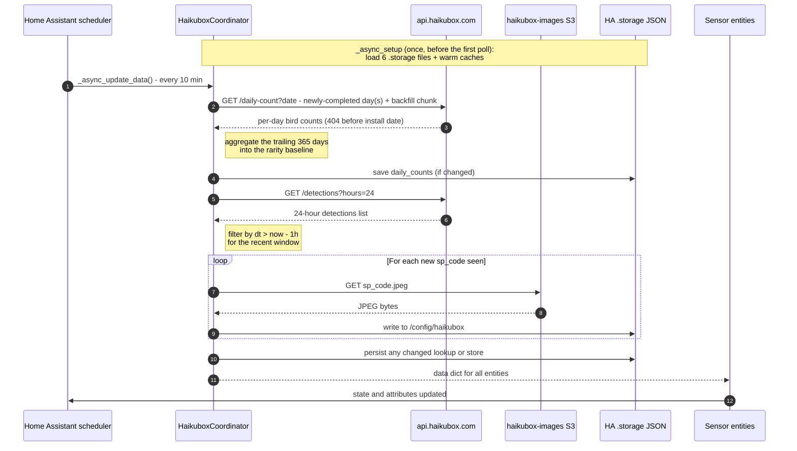

# Haikubox API usage

This page lists every network request the integration makes: which endpoint, when, with what parameters, and what happens to the response. It's meant for debugging, estimating request volume, or understanding what happens when Haikubox is down.

The integration only reads. It uses the public Haikubox API and the Haikubox image bucket on S3, and never writes anything back.

## Endpoints

| Endpoint | When | Auth | Response |
|---|---|---|---|
| `GET https://api.haikubox.com/haikubox/<serial>` | Setup and reconfigure; once per coordinator to get the box's time zone | None | `{ "haikuboxName": "<name>", "tz": "<IANA tz>", … }` |
| `GET https://api.haikubox.com/haikubox/<serial>/detections?hours=24` | Once per poll | None | `{ "detections": [ {cn, sn, spCode, dt}, … ] }` |
| `GET https://api.haikubox.com/haikubox/<serial>/daily-count?date=<YYYY-MM-DD>` | Newly finished days each poll, plus a one-time history download | None | `[ { "bird": "<name>", "count": <int> }, … ]`, or `404` for days before the box was installed |
| `GET https://haikubox-images.s3.amazonaws.com/<sp_code>.jpeg` | Once per species | None | JPEG |

All requests use Home Assistant's shared `aiohttp` session (`async_get_clientsession(hass)`). There are no auth headers. The serial in the URL is all Haikubox needs.

Code: [`api.py`](../custom_components/haikubox/api.py) has all the api.haikubox.com calls. [`const.py`](../custom_components/haikubox/const.py) has the URLs and intervals, [`coordinator.py`](../custom_components/haikubox/coordinator.py) runs the poll, [`config_flow.py`](../custom_components/haikubox/config_flow.py) handles setup, and [`image_cache.py`](../custom_components/haikubox/image_cache.py) and [`audio_cache.py`](../custom_components/haikubox/audio_cache.py) fetch media.

## One poll

Requests run one after another. The `/daily-count` and `/detections` calls could run in parallel, but Haikubox responds quickly enough that it hasn't been worth it. History downloads are spaced out on purpose (`BACKFILL_REQUEST_DELAY`) so a new install doesn't hit the API in a burst.

## `GET /haikubox/<serial>`: device info

**Code:** `async_get_device_info` in [`api.py`](../custom_components/haikubox/api.py) for setup, and `HaikuboxApiClient.async_box_tz` for the time zone.

During setup there are three possible outcomes:

- `200`: the serial is good and the entry is created.
- Any other status: `invalid_serial` ("No shared Haikubox found for that serial").
- No response at all: `cannot_connect` ("Could not reach the Haikubox API").

Keeping those last two apart lets the user know whether to check their serial or their network.

`haikuboxName` from the response becomes the device name, for example "Bird Shazam". If it's missing, the name is `Haikubox <serial>`. The user can rename the device afterwards.

After setup the name is stored in `entry.data[CONF_DEVICE_NAME]`, and this endpoint is only called again for the time zone or if the user reconfigures.

## `GET /haikubox/<serial>/detections?hours=24`: detections

**Code:** `HaikuboxApiClient.fetch_detections` in [`api.py`](../custom_components/haikubox/api.py), called through the coordinator's `_fetch_detections`.

`hours` can be 1 to 24. The integration always asks for 24, once per poll. Everything else comes from that one response by filtering on each item's `dt`: the 1-hour `recent_detections`, the `last_detection` event list, new-species tracking, and today's part of the 7-day rarest list.

`_normalise_detections` in [`normalize.py`](../custom_components/haikubox/normalize.py) then:

1. Drops `soundscape` entries, which aren't birds.
2. Merges the list into one record per species, adding up the counts and keeping the latest `dt` as `last_seen`.
3. Renames the fields:

| API field | Integration field |
|---|---|
| `cn` | `species` (common name) |
| `sn` | `scientific_name` |
| `spCode` | `sp_code` |
| `dt` | `last_seen` (ISO 8601) |

Records are sorted newest first. `_apply_rarity_scores` then adds `rarity_score` and `yearly_rank` from the rarity baseline (below).

### The recent window

`_filter_by_dt(raw, threshold)` keeps the raw items with `dt` within the last `RECENT_WINDOW_HOURS` (1 by default). That filtered list is normalized separately from the 24-hour list. Filtering happens first so that `count` on `recent_detections` means "times heard in the last hour", not "in the last 24 hours".

Both the integration's clock and `dt` are in UTC. `dt` is parsed with `datetime.fromisoformat`, which accepts a trailing `Z` on Python 3.11 and later. A `dt` with no time zone is assumed to be UTC, and a missing or unreadable `dt` is skipped.

| Sensor or feature | Data used |
|---|---|
| `recent_detections`, new-species tracking | Items from the last hour |
| `daily_count`, `daily_top_species`, `notable_species`, today's part of `rarest_species`, the first-install `_seen_species` seed | All 24 hours |
| `last_detection.detections` | A saved list of the last 50 detections, topped up from each poll's 24-hour data |
| `new_species.detections` | The saved `_seen_species` log |

### Request volume

One `/detections` call per poll, so 144 a day per box at the default 10 minutes. The interval can be anything from 5 to 60 minutes (see [advanced.md](advanced.md)). On top of that there's about one `/daily-count` call a day once history is downloaded, and one image per species, ever.

A new install also downloads its history. It fetches `RARITY_BACKFILL_CHUNK` (30) days per poll until it has a year, then `HISTORY_BACKFILL_CHUNK` (10) days per poll for anything older, with `BACKFILL_REQUEST_DELAY` between requests, back to the day the box was installed. The first year takes an hour or two and older history longer.

## `GET /haikubox/<serial>/daily-count?date=<YYYY-MM-DD>`: daily counts

**Code:** `HaikuboxApiClient.fetch_daily_count` in [`api.py`](../custom_components/haikubox/api.py), called through `_fetch_daily_count` and driven by `_ensure_daily_counts`.

Returns one calendar day's count per species as `[{bird, count}]`. The useful part is that it accepts any past `date`, so the integration can build its own rolling 12-month rarity baseline. The alternative, `/yearly-count`, covers the calendar year: it resets every January 1st, and rarity drifts as the year goes on.

**Storage.** Daily counts are saved in `.storage/haikubox.<serial>.daily_counts` as `{ "YYYY-MM-DD": { species: count } }`. Only finished days are stored, and they're kept for the life of the box. Each poll, `_ensure_daily_counts`:

1. Fetches any days that have finished since the last run, newest first, until it reaches days it already has.
2. Fetches older history toward the install date, `RARITY_BACKFILL_CHUNK` (30) days per poll until `RARITY_WINDOW_DAYS` is covered, then `HISTORY_BACKFILL_CHUNK` (10) per poll, spaced by `BACKFILL_REQUEST_DELAY`. A `404` means the box didn't exist yet. After `BACKFILL_STOP_AFTER_404` (14) 404s in a row older than anything stored, the download is marked complete. Fourteen is enough to get past an outage of several days and keep going.
3. Saves once if anything changed. A `try/finally` keeps partial progress if a download is interrupted. Once history is complete, that's about one write a day.

**Scoring.** `_rebuild_baseline` adds up the last `RARITY_WINDOW_DAYS` (365) of stored counts and turns them into a species → rank map with `_ranks_from_counts`. Rarity is the rank divided by the number of species: ranked 50th of 200 scores 0.25. A species that isn't in the map scores 1.0, the same as the rarest species that is. Because the window rolls, a species' score doesn't jump at New Year.

**Failures.** `_async_setup` loads `_daily_counts` and rebuilds the baseline at startup, so rarity works right away after a restart. A `404` or empty response means no data for that day and isn't an error. A `429` or 5xx during the history download stops the download until the next poll, and doesn't count toward the 404 limit, so a rate limit can't be mistaken for the install date. The only case that raises `UpdateFailed` is a brand-new install whose very first download finds nothing. The sensors are unavailable until Home Assistant's automatic retry succeeds.

## Images

**Code:** [`image_cache.py`](../custom_components/haikubox/image_cache.py)

Photos come from `https://haikubox-images.s3.amazonaws.com/<sp_code>.jpeg`, a public bucket.

Each species is downloaded once:

1. For each detection, the coordinator calls `ImageCache.async_fetch(sp_code)`.
2. If the code is already in the in-memory `_cached` set, the local URL comes back without a request.
3. Otherwise the JPEG is downloaded, written to `/config/haikubox/<sp_code>.jpeg` with `aiofiles`, and added to `_cached`.
4. `image_url` becomes `/haikubox/cache/<sp_code>.jpeg`. That path is served by the integration itself (registered in `async_setup`, after creating the folder), so it works offline and doesn't depend on HA's `/local`.

If the download fails, `async_fetch` returns the S3 URL instead. The card can still show the photo, and the next poll tries to save it again. `url_for(sp_code)`, used by `_build_today_top` and `_build_baseline_top`, does the same thing without downloading.

The cache folder is scanned once at startup (`async_init` → `_index`). After that, every lookup is an in-memory check.

## Polling

| Constant | Value | Where |
|---|---|---|
| `DEFAULT_SCAN_INTERVAL` | 600 s (10 min); adjustable 5–60 min | [`const.py`](../custom_components/haikubox/const.py) |
| `RECENT_WINDOW_HOURS` | 1 h; applied by the integration, not sent to the API; adjustable 1–24 h | [`const.py`](../custom_components/haikubox/const.py) |
| `DAILY_WINDOW_HOURS` | 24 h | [`const.py`](../custom_components/haikubox/const.py) |

Each poll asks for 24 hours of data, so a missed poll loses nothing: the next one picks up the same detections. 24 hours is the most the API allows.

The poll interval and recent window are in the options flow's **Advanced** section, along with the rarity and new-species windows (see [advanced.md](advanced.md)). For polling on a schedule, or outside 5–60 minutes, turn off Home Assistant's **Enable polling for updates** and refresh from an automation (also in advanced.md).

## Failure handling

| Failure | What happens |
|---|---|
| `/detections` raises `aiohttp.ClientError` | `_async_update_data` raises `UpdateFailed`, and sensors are unavailable until the next good poll |
| `/daily-count` returns `404` | No data for that day, or the box didn't exist yet. Not an error. |
| `/daily-count` returns `429` or 5xx during history download | Download stops until the next poll, progress is saved, the 404 count isn't advanced |
| `/daily-count` connection error during history download, with saved history | Warning logged, baseline rebuilt from saved history, download retried next poll |
| No saved history and the first download finds nothing | `UpdateFailed`; sensors unavailable until the next good poll. HA retries a new install's first refresh automatically. |
| Image download returns non-200 | Card uses the S3 URL; the next poll tries to save it again |
| Image download raises | Same, and it's logged at DEBUG |
| `/haikubox/<serial>` returns non-200 during setup | `invalid_serial` ("No shared Haikubox found"); no entry created |
| `/haikubox/<serial>` raises `aiohttp.ClientError` during setup | `cannot_connect` ("Could not reach the Haikubox API"); no entry created |

Failed requests aren't retried within a poll. The next poll tries again.

## Diagnostics

The diagnostics download ([`diagnostics.py`](../custom_components/haikubox/diagnostics.py)) includes the coordinator's data and the entry's data, with the serial removed. It's safe to attach to a bug report.
