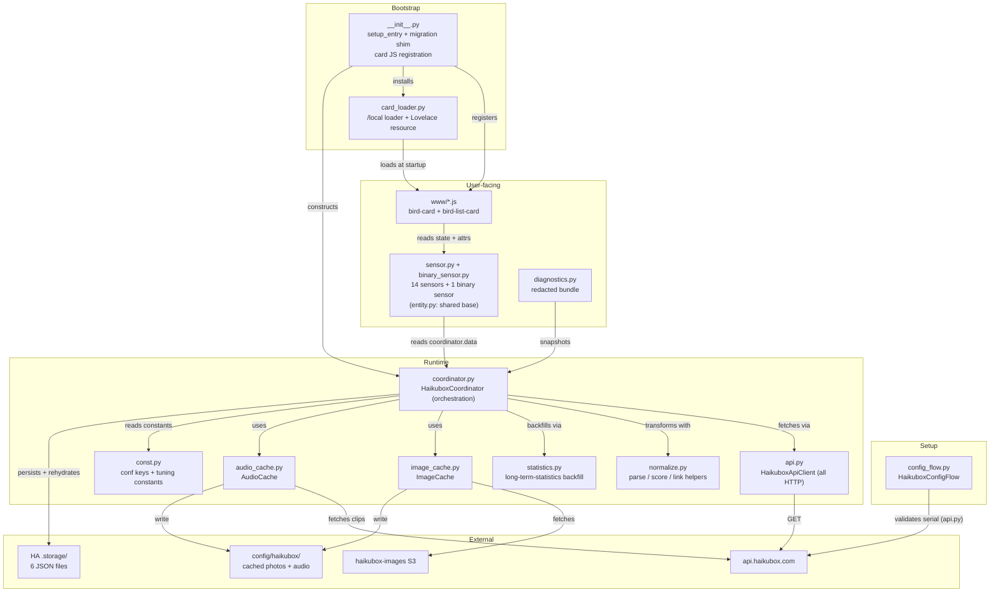
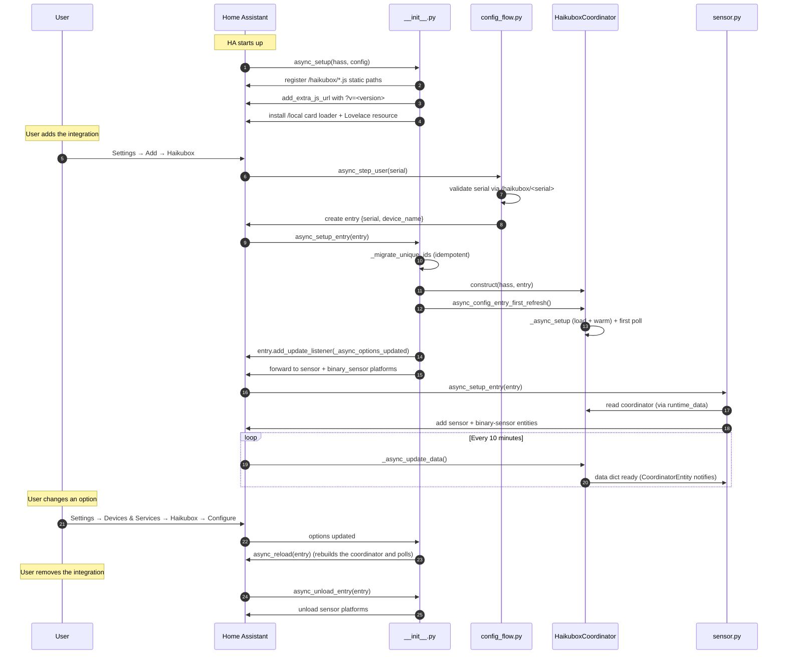

# Architecture

This page covers how the code is organized: what each module does, how data gets from the Haikubox API to the sensors, what's kept where, and what runs when. If you're about to read the code, start here.

For the network requests, see [api.md](api.md). For what the sensors expose, see [sensors.md](sensors.md).

## Component map



## File layout

```text
custom_components/haikubox/
├── __init__.py           # setup and teardown, migrations, cache static path, card registration
├── api.py                # HaikuboxApiClient (all HTTP) and the setup-time device check
├── audio_cache.py        # AudioCache: download, normalize and prune detection clips
├── binary_sensor.py      # extended-silence binary sensor
├── card_loader.py        # copies the card loader to config/www and registers it as a resource
├── config_flow.py        # config flow (setup and reconfigure) and options flow
├── const.py              # domain, config keys, tuning constants, event and trigger names
├── coordinator.py        # HaikuboxCoordinator: runs each poll
├── device_trigger.py     # new_species / unusual_visitor / watched_species triggers
├── diagnostics.py        # redacted state dump
├── entity.py             # HaikuboxEntity: shared device info for the platforms
├── image_cache.py        # ImageCache: download each species photo once, serve it locally
├── manifest.json         # the version here is the release version
├── normalize.py          # response parsing, rarity and notability scoring, link URLs
├── sensor.py             # 14 sensor classes
├── statistics.py         # long-term statistics backfill
├── strings.json          # translation keys and display names
├── translations/
│   └── en.json
├── data/                 # eBird common name → code / scientific name map, plus NOTICE
├── brand/                # logo and icon (also in home-assistant/brands)
└── www/
    ├── haikubox-bird-card.js     # single-bird card
    ├── haikubox-details-card.js  # list card
    └── haikubox-card-loader.js   # startup loader, copied to config/www
```

## The coordinator runs the poll, other modules do the work

[`coordinator.py`](../custom_components/haikubox/coordinator.py) runs each poll in order, holds the in-memory and saved state, and builds the data dict the sensors read. The pieces that don't need its state live in their own modules:

- **`api.py`**: `HaikuboxApiClient` makes every request to api.haikubox.com (detections, daily counts, the box's time zone). `async_get_device_info` and `CannotConnect`, used by setup, are here too, so all network code is in one file. The coordinator's small `_fetch_*` and `_async_box_tz` methods call the client, which lets tests stub the network per coordinator.
- **`normalize.py`**: plain functions for parsing `dt`, the recent-window filter, merging detections by species, ranking and scoring, and building reference links. No coordinator or Home Assistant state.
- **`statistics.py`**: the long-term statistics backfill (`async_import_history_statistics`). The recorder imports stay inside it so they only load when used.
- **`image_cache.py`** and **`audio_cache.py`**: the photo cache and the optional clip cache.

Everything else is thin:

- **Sensors** only read from `self.coordinator.data`. None of them call the API, keep state, or do any work. `PARALLEL_UPDATES = 0` because they all read the same dict. `entity.py` has their shared device info.
- **The config flow** checks the serial with `api.async_get_device_info` and saves it. It never talks to the coordinator. Home Assistant calls `async_setup_entry`, which builds the coordinator from `entry.data`.
- **`__init__.py`** is mostly registration: the cache static path, the card JS and loader, migrations, and forwarding to the sensor and binary sensor platforms.

### Inside `_async_update_data`

Saved data is loaded and the caches are warmed once, in `_async_setup`. That's the `DataUpdateCoordinator` hook that runs before the first refresh, so the poll itself never has to check whether things are loaded.

```mermaid
flowchart TD
    Start([poll fires every 10 min]) --> EnsureDaily

    EnsureDaily[_ensure_daily_counts<br/>new completed day + backfill chunk<br/>via /daily-count?date] --> Rebuild[_rebuild_baseline<br/>aggregate trailing 365d<br/>→ rank lookup]
    Rebuild --> FetchDetections

    FetchDetections[GET /detections?hours=24] --> FilterRecent[_filter_by_dt<br/>raw items where<br/>dt &gt; now - 1h]
    FilterRecent --> NormaliseRecent[_normalise_detections<br/>on recent subset<br/>+ _apply_rarity_scores]
    NormaliseRecent --> NormaliseDaily[_normalise_detections<br/>on full 24h →<br/>daily_count + rarity]

    NormaliseDaily --> CacheImages[ImageCache.async_fetch<br/>per recent sp_code]
    CacheImages --> Lookups[update sp_codes,<br/>sci_names, last_seen]

    Lookups --> SeedSeen{_seen_species<br/>empty?}
    SeedSeen -- fresh install --> SeedFrom24h[seed _seen_species<br/>from daily_count;<br/>warm image cache]
    SeedSeen -- existing --> NewSpecies
    SeedFrom24h --> NewSpecies

    NewSpecies[track new species<br/>vs _seen_species<br/>from recent window] --> Rarest[_build_rarest<br/>last 7d of daily_counts + today<br/>scored by baseline]
    Rarest --> Notability[_apply_notability_scores<br/>on daily_count<br/>weight from entry.options]

    Notability --> Events[_build_recent_events this poll<br/>→ merge into persisted event buffer<br/>top 50 by dt; backs last_detection]
    Events --> History[_build_new_species_history<br/>top 50 by first_seen desc<br/>for new_species.detections]
    History --> Build[build output dict]

    Build --> Done([return → sensors update])
```



Each step waits for the one before it. There's no `asyncio.gather` and no background tasks, which keeps the ordering easy to follow:

- The rarity baseline has to be rebuilt before anything is scored.
- The 24-hour list has to exist before the `_seen_species` seed. The seed runs before new-species tracking so a new install is seeded from the full 24 hours, not just the last hour (issue #14).
- `rarest_species` uses the last 7 days of `daily_counts` plus today's 24-hour list, so birds heard 1–24 hours ago count toward today (issue #15).
- `last_detection` reads a saved list of recent events. Each poll's events (`_build_recent_events`) are merged in, with duplicates removed and a cap of 50, so it survives restarts and outages (issue #62). `notable_species` isn't saved. It empties with its 24-hour window and becomes `unknown`.
- Notability is scored last. It reads `notable_rarity_weight` from `entry.options` and adds `notability_score` to each 24-hour record.

### One data dict

Each poll returns one `dict[str, Any]`. Most keys match sensor names. The exceptions:

- **Single records are kept apart from their lists:** `last_detection` (the newest saved event) and `recent_events` (the list); `notable_detection` (the current top, or `None`) and `notable_detections`; `new_detection` and `new_detections`. `last_detection` and `new_detection` are saved. `notable_detection` isn't, and becomes `None` (so the sensor is `unknown`) when its 24-hour window is empty (issue #62).
- **`recent_events`** is the per-detection list behind `last_detection`'s `detections` attribute: the last 50 detections, newest first, with duplicates removed.
- **`lifetime_species_count`** is a single number, shown as an attribute on `new_species`.

This dict is the contract between the coordinator and the sensors:

> The keys the coordinator produces must match the keys the sensors read. An AST parity check enforces this.

Adding a sensor means adding one key to the dict and one sensor class. The two sides only need to agree on the key name.

See [sensors.md](sensors.md) for the `detections` attribute.

## State

The coordinator has three kinds of state.

### 1. Rebuilt every poll

Local variables in `_async_update_data`: `detections` (last hour, newest first), `daily_count` (24 hours, by count), `notable` (24 hours, by `notability_score`), `seven_day_rare` (from `_build_rarest`), and `poll_events` (this poll's events from `_build_recent_events`, merged into the saved list). The `new_species` list comes from `_build_new_species_history()`, which reads the saved `_seen_species`, so it carries over between polls.

### 2. Saved in `.storage/`

| Field | Saved as | Loaded by |
|---|---|---|
| `_seen_species: dict[str, str]` | `haikubox.<serial>.seen_species` | `_async_setup` |
| `_sp_codes: dict[str, str]` | `haikubox.<serial>.sp_codes` | `_async_setup` |
| `_sci_names: dict[str, str]` | `haikubox.<serial>.sci_names` | `_async_setup` |
| `_last_seen: dict[str, str]` | `haikubox.<serial>.last_seen` | `_async_setup` |
| `_daily_counts: dict[str, dict[str, int]]` for the life of the box. `_baseline_ranks`, `_baseline_species_count` and `_baseline_items` are rebuilt from it. | `haikubox.<serial>.daily_counts` | `_async_setup`, which also rebuilds the baseline |
| `_event_buffer: list[dict]`, the last 50 detections behind `last_detection` | `haikubox.<serial>.recent_events` | `_async_setup` |

Each file is only written when its data changes, tracked with a dirty flag. The event list, for example, is only written when a poll adds a new detection.

### 3. Photos and audio on disk

Photos are saved as `/config/haikubox/<sp_code>.jpeg`, and audio clips under `audio/<serial>/` in the same folder. The integration serves that folder itself at `/haikubox/cache/`. The path is registered in `async_setup` after the folder is created, so it works on a new install without HA's `/local` (which only exists if `config/www` was there at startup). `ImageCache` reads the folder once at startup into an in-memory `_cached` set, so lookups after that don't touch the disk.

## Lifecycle



Changing an option reloads the entry rather than just refreshing it. Some options (poll interval, audio, the windows) are read once when the coordinator is created, so a refresh wouldn't pick them up.

## Migration

[`_migrate_unique_ids`](../custom_components/haikubox/__init__.py) runs on every `async_setup_entry`. It renames 0.3.x unique IDs to their 0.4 names in the entity registry:

```python
_UNIQUE_ID_RENAMES = {
    "last_detected":     "last_detection",
    "notable_detection": "notable_species",
    "daily_top":         "daily_top_species",
    "yearly_top":        "yearly_top_species",
    "seven_day_rare":    "rarest_species",
}
```

It's safe to run every time. If the old ID isn't there (a new install, or already migrated), nothing happens. If the new ID already exists, it leaves both alone. `new_species` isn't in the table because its ID didn't change, and mapping it would break a working entity.

`daily_species` was removed in 0.4 and can't be migrated. Users are left with an orphaned entity they can delete.

The other migrations in `__init__.py` move the photo cache out of `config/www/haikubox` (older versions kept it there) and move 0.7's flat audio cache into per-serial folders.

### Minimum HA version

`hacs.json` sets the minimum to Home Assistant 2025.4. The reason is the recorder statistics API used by [`statistics.py`](../custom_components/haikubox/statistics.py): `StatisticMeanType` and the `mean_type` field on `StatisticMetaData` arrived in 2025.4.0. On older versions the import fails and every poll fails with it. The code also passes `unit_class=None`, which only became a real `StatisticMetaData` field in 2025.11. Older versions ignore it.

That floor also covers two older requirements from 2024.12: `OptionsFlow.config_entry` became read-only (the options flow relies on the framework setting it), and the sections grid sizing API the cards use.

## Custom cards

The two cards in `www/` are registered in `async_setup`:

- `haikubox-bird-card` ([www/haikubox-bird-card.js](../custom_components/haikubox/www/haikubox-bird-card.js)) shows one bird. It reads `attrs.detections[position - 1]` for every sensor. It supports HA's standard `tap_action`, plus a custom `show-list`, and the `{species}`, `{species_slug}`, `{sp_code}` and `{scientific_name}` tokens, which come from the bird being shown.
- `haikubox-bird-list-card` ([www/haikubox-details-card.js](../custom_components/haikubox/www/haikubox-details-card.js)) shows a ranked list with rows that expand. It reads `attrs.detections`. The bird card's ⓘ popup reuses it in `detail_only` mode.

The cards only read sensor state through the frontend's WebSocket connection. They know nothing about the coordinator or the API.

### How the cards get onto the page

`add_extra_js_url` adds the card URLs, with `?v=<version>` to bust the browser cache, to the page HTML. HA writes that list into `index.html` when it serves the page, and the frontend never loads anything added later. HA starts serving pages before stage-2 integrations like this one have run `async_setup`, so a page loaded during startup has no cards. A browser or app reconnecting after a restart reloads during exactly that window.

[`card_loader.py`](../custom_components/haikubox/card_loader.py) handles that case:

- It copies `www/haikubox-card-loader.js` to `config/www/`. `/local` is set up by the frontend integration before the web server starts, so the loader can always be fetched.
- It registers the loader as a Lovelace resource at `/local/haikubox-card-loader.js?v=<version>`. Resources are saved in `.storage`, so the page lists the loader even during startup. There's exactly one entry: upgrades update it in place, and duplicates are removed.
- The loader imports the real card modules from `/haikubox/…`, retrying with backoff until the static path exists. Lovelace rebuilds its error cards once the elements are defined.
- Its first try uses the same URL as `add_extra_js_url`, so the browser runs each module once whichever gets there first.

This only works for storage-mode dashboards. YAML dashboards have to add the resource themselves. Removing the last entry removes the resource and the file.

### Card robustness

- **Entity picker filter.** The editors only offer Haikubox sensors with a `detections` list.
- **Broken images.** A photo that fails to load is replaced with the 🐦 placeholder, so the browser's broken-image icon never shows.
- **Relative time.** A 60-second timer, started in `connectedCallback`, rewrites just the "5m ago" text. There's no full re-render, so images don't flicker and open rows don't collapse.
- **`setConfig` / `set hass` order.** HA normally calls `setConfig` before `set hass`, but during a dashboard reload `set hass` can come first. `_render` and `_handleTapAction` return early when there's no config yet, instead of throwing and leaving the card stuck on HA's error card.
- **Loading twice.** If a card's JS runs twice on the same page (the loader and `add_extra_js_url` under different URLs, or a cache hiccup during an upgrade), `customElements.define` and `customCards.push` are skipped when the element already exists.

## Automation events

The coordinator fires one bus event, `haikubox_event`, with a `type` field of `new_species`, `unusual_visitor` or `watched_species`. HA does the same with `deconz_event` and `bthome_ble_event`. `_fire_detection_events` runs at the end of `_async_update_data`, after the lookup tables are updated:

- **`new_species`** fires for species in `newly_seen`, the ones added to the first-seen log this poll. A new install doesn't fire, because the seed fills `_seen_species` first.
- **`unusual_visitor`** fires for species that are in the recent window now but weren't last poll (`current_recent − _prev_recent_species`), and that had been gone at least `absence_days`. `_prev_recent_species` starts as `None`, so the first poll after a restart only records a starting point. Because it only fires when a species first appears, a bird that stays for several polls fires once.
- **`watched_species`** fires when a species on the watch list enters the recent window. The watch list is the options flow's pick list plus any typed-in names. It uses the same first-appearance check as `unusual_visitor`. A brand-new watched bird fires both `new_species` and `watched_species`.

[`device_trigger.py`](../custom_components/haikubox/device_trigger.py) offers all three as device triggers (`TRIGGER_TYPES`). `async_attach_trigger` hands off to HA's own event trigger (`homeassistant.components.homeassistant.triggers.event`), filtered on `haikubox_event`, `device_id` and `type`. The device trigger is just a filter on the event, not a separate listener.

The four blueprints are in `blueprints/automation/haikubox/` at the repo root. They also serve as examples of the event fields: photo, reference-link buttons, `lifetime_species_count` and `audio_url`. Every event carries all of those fields. An integration can't install blueprints for the user, so they're imported by URL (see [automations.md](automations.md)).

## Design decisions

- **One coordinator for everything.** All sensors share one `DataUpdateCoordinator`. Updating any entity refreshes them all, which is what makes the custom polling automation in [advanced.md](advanced.md) work.
- **`_unrecorded_attributes = {"detections"}`** on every sensor. The lists can have 50 or more records. Recording them on every state change would bloat the database and trigger HA's attribute size warnings. The cards still read them from the live state.
- **Migration runs every setup.** There's no "already migrated" flag to maintain. The shim just checks the registry.
- **Seeding `_seen_species` from 24 hours.** A new install seeds the first-seen log from the 24 hours of data it already has. Otherwise every bird would show up as new on the first day. See [sensors.md](sensors.md). `last_detection` doesn't need a seed, because its list fills from the first poll.
- **The box's time zone decides what "today" is.** The coordinator's today is `dt_util.now(await self._async_box_tz()).date()`, using the time zone from `/haikubox/<serial>` (HA's time zone until that's known). It sets the rarity window, the 7-day rarest window, the daily sensors, and which `/daily-count` dates to ask for. `/daily-count` is keyed by the box's local date, and using UTC ran ahead of the box every evening and caused 400 errors (issue #16). Recent-window checks compare instants, so they stay in UTC.
- **Lists that should survive are saved.** `last_detection.detections` (the last 50 detections) and `new_species.detections` (the last 50 first-time species) are saved and survive restarts and outages, so the bird card always has something to show once the box has any history. `notable_species` is a 24-hour window on purpose: going `unknown` after a day of silence is how you notice the box is down (issue #62).
- **Notability is adjustable.** `notable_species` ranks by `notability_score = w · rarity_score + (1 − w) · recency_score`, and `w` is a 0–100% slider in the options flow. Changing it reloads the entry, so the ranking updates right away.
- **Cards read state, not the coordinator.** Card YAML can be copied to another Home Assistant install and works as long as the sensors exist.
