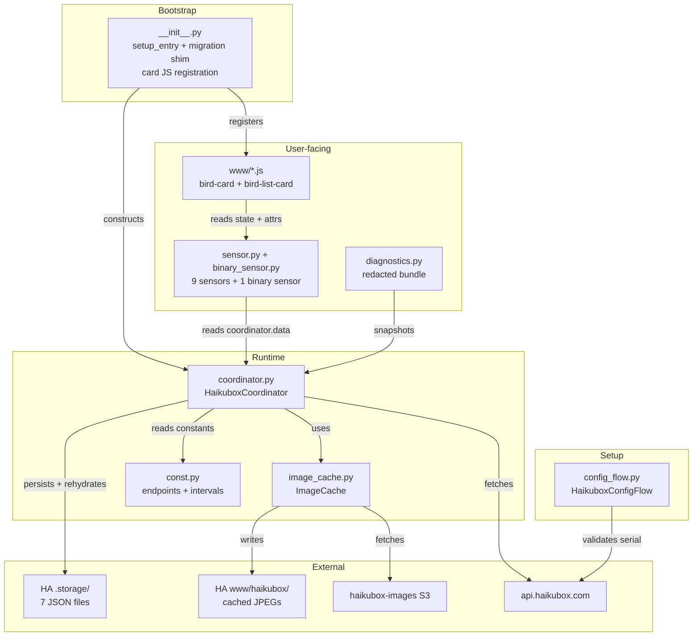
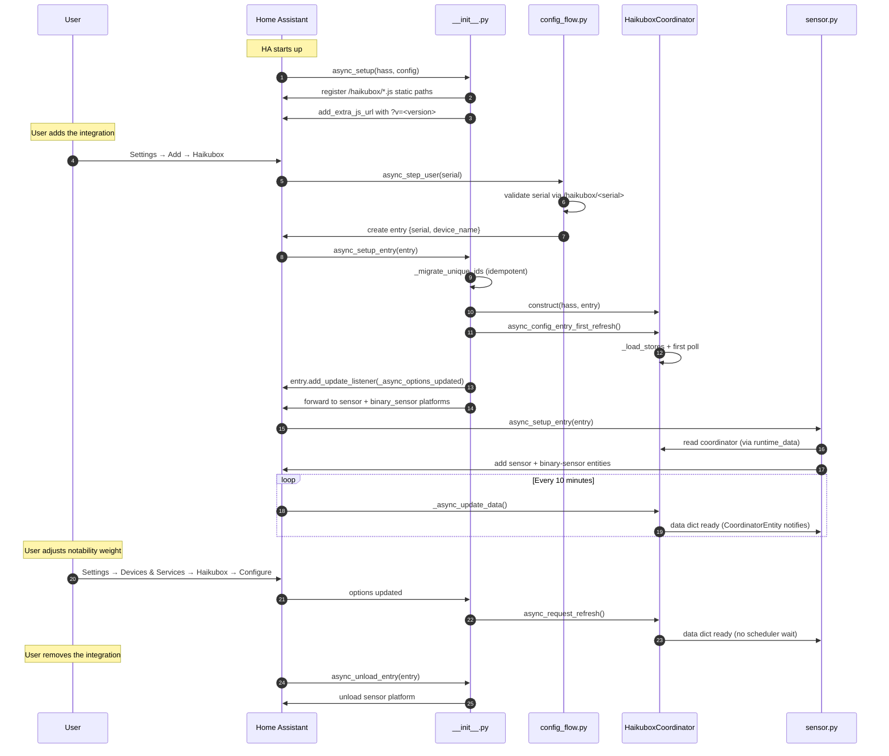

# Architecture

This page describes how the integration is structured internally: what each module does, how data moves through the system, what state is held where, and what runs when.

If you want to read code with a map in hand, start here. For external API behaviour (what HTTP calls are made), see [docs/api.md](api.md). For the user-facing sensor contract, see [docs/sensors.md](sensors.md).

## Component map



## File layout

```text
custom_components/haikubox/
├── __init__.py           # setup + teardown; migration shim; card registration
├── binary_sensor.py      # detection-problem binary sensor
├── config_flow.py        # config flow (initial + reconfigure) + options flow
├── const.py              # domain, conf keys, API base URLs, intervals, event/trigger names
├── coordinator.py        # HaikuboxCoordinator + helpers (the brains)
├── device_trigger.py     # new_species / unusual_visitor device triggers
├── diagnostics.py        # redacted state dump
├── image_cache.py        # ImageCache class
├── manifest.json         # HACS manifest (version stamped on release)
├── sensor.py             # 9 sensor classes
├── strings.json          # translation keys → display names
├── translations/
│   └── en.json
├── brand/
│   ├── icon.png          # 256×256, HA-2026.3+ proxy serves this
│   └── icon@2x.png       # 512×512
└── www/
    ├── haikubox-bird-card.js     # single-bird card (registered via static path)
    └── haikubox-details-card.js  # ranked list card
```

## The coordinator is the centre of gravity

Everything interesting happens in [`coordinator.py`](../custom_components/haikubox/coordinator.py). The integration is deliberately thin elsewhere:

- **Sensors** are dumb projections — `native_value` and `extra_state_attributes` just read from `self.coordinator.data`. No sensor ever calls the API, holds state, or does work. `PARALLEL_UPDATES = 0` because they all read the same in-memory dict; HA's parallelism guard isn't relevant.
- **The config flow** validates a serial and stores it. It doesn't talk to the coordinator at all — once the entry exists, `async_setup_entry` is HA's responsibility and it constructs the coordinator from `entry.data`.
- **`__init__.py`** is mostly registration boilerplate (static paths for card JS, the migration shim, forward to the sensor platform).
- **`image_cache.py`** is the only other piece that touches the network, and it's a single-purpose write-once cache.

### Inside `_async_update_data`

```mermaid
flowchart TD
    Start([poll fires every 10 min]) --> LoadStores{stores loaded?}
    LoadStores -- no --> Load[load 6 .storage files<br/>rehydrate stickies;<br/>rebuild baseline]
    LoadStores -- yes --> EnsureDaily
    Load --> EnsureDaily

    EnsureDaily[_ensure_daily_counts<br/>new completed day + backfill chunk<br/>via /daily-count?date] --> Rebuild[_rebuild_baseline<br/>aggregate trailing 365d<br/>→ rank lookup]
    Rebuild --> FetchDetections

    FetchDetections[GET /detections?hours=24] --> FilterRecent[_filter_by_dt<br/>raw items where<br/>dt &gt; now - 1h]
    FilterRecent --> NormaliseRecent[_normalise_detections<br/>on recent subset<br/>+ _apply_rarity_scores]
    NormaliseRecent --> NormaliseDaily[_normalise_detections<br/>on full 24h →<br/>daily_count + rarity]

    NormaliseDaily --> CacheImages[ImageCache.async_fetch<br/>per recent sp_code]
    CacheImages --> Lookups[update sp_codes,<br/>sci_names, last_seen]

    Lookups --> SeedSeen{_seen_species<br/>empty?}
    SeedSeen -- fresh install --> SeedFrom24h[seed _seen_species<br/>from daily_count;<br/>warm image cache]
    SeedSeen -- existing --> NewSpecies
    SeedFrom24h --> NewSpecies

    NewSpecies[track new species<br/>vs _seen_species<br/>from recent window] --> Rarest[_build_rarest<br/>last 7d of daily_counts + today<br/>scored by baseline]
    Rarest --> Sticky[update sticky last_detected<br/>+ last_notable from recent]

    Sticky --> StickyBoot{stickies<br/>still None?}
    StickyBoot -- fresh install --> SeedSticky[seed stickies<br/>from daily_count]
    StickyBoot -- existing --> Notability
    SeedSticky --> Notability

    Notability[_apply_notability_scores<br/>on daily_count<br/>weight from entry.options] --> Events[_build_recent_events<br/>top 50 by dt desc<br/>for last_detection.detections]
    Events --> History[_build_new_species_history<br/>top 50 by first_seen desc<br/>for new_species.detections]
    History --> Build[build output dict]

    Build --> Done([return → sensors update])
```



The flow is **strictly sequential** — each `await` waits for the previous one. There's no `asyncio.gather` and no background tasks. This keeps the data dependencies explicit:

- The rarity baseline (the trailing-window aggregate from `daily_counts`) must be rebuilt before rarity scoring.
- `daily_count` (the 24-hour normalisation) has to land before the `_seen_species` bootstrap — that bootstrap fires *before* the recent-window new-species loop so a fresh install seeds from the full 24-hour window, not just the 1-hour subset (see issue #14).
- `rarest_species` reads the last 7 days of `daily_counts` plus today's 24h list, so species heard 1–24h ago still count toward today (see issue #15).
- Sticky updates run after the recent-window processing has populated `_last_detected`, so the fresh-install bootstrap can correctly distinguish "we already have a value" from "we need to seed one."
- Notability is the last scoring pass: it reads the user-tuned `notable_rarity_weight` from `entry.options` and stamps a blended `notability_score` on every `daily_count` record before the output dict is built.

### Why everything funnels through one dict

The coordinator returns a single `dict[str, Any]` per poll. Most keys mirror sensor IDs directly. The deliberate exceptions:

- **Sticky singular records** are split from their plural list counterparts: `notable_detection` (sticky) vs. `notable_detections` (list); `new_detection` (sticky) vs. `new_detections` (list). The sticky records survive HA restarts via `.storage/.sticky`; the lists are recomputed each poll.
- **`recent_events`** is the per-event list (most recent 50 events in 24 h, ranked by `dt` desc) that `last_detection`'s `detections` attribute reads — distinct from `last_detection` itself, which is the sticky single record carrying the state's species name.
- **`lifetime_species_count`** is a scalar exposed on `new_species` as an attribute.

This shape is the **contract** between the coordinator and the sensors:

> Coordinator-produced key set == sensor-consumed key set. Violations are caught by an AST parity check, not by runtime.

That's what makes the sensors trivial to write and the integration easy to refactor: adding a new sensor means adding one dict key on the coordinator side and one sensor class on the consumer side, and they can be developed independently as long as they agree on the key name.

See [docs/sensors.md](sensors.md) for the full key contract and the `detections` attribute shape.

## State and persistence

The coordinator holds three categories of state:

### 1. Volatile in-memory (rebuilt every poll)

Locals in `_async_update_data`: `detections` (1h subset, ranked by recency), `daily_count` (24h list, ranked by count), `notable` (24h list, ranked by `notability_score`), `seven_day_rare` (`_build_rarest` output — last 7 days of `daily_counts`), `recent_events` (per-event log → `last_detection.detections`). Plus the lifetime-history list returned by `_build_new_species_history()` (→ `new_species.detections`), built from the durable `_seen_species` log so it's effectively sticky from poll to poll.

### 2. Sticky in-memory (persisted to `.storage/`)

| Field | Persisted as | Rehydrated by |
|---|---|---|
| `_seen_species: dict[str, str]` | `haikubox.<serial>.seen_species` | `_load_stores` |
| `_sp_codes: dict[str, str]` | `haikubox.<serial>.sp_codes` | `_load_stores` |
| `_sci_names: dict[str, str]` | `haikubox.<serial>.sci_names` | `_load_stores` |
| `_last_seen: dict[str, str]` | `haikubox.<serial>.last_seen` | `_load_stores` |
| `_daily_counts: dict[str, dict[str, int]]` (full lifetime) — the derived `_baseline_ranks` / `_baseline_species_count` / `_baseline_items` are rebuilt from its trailing window | `haikubox.<serial>.daily_counts` | `_load_stores` (baseline rebuilt at load) |
| `_last_detected`, `_last_notable` | `haikubox.<serial>.sticky` | `_load_stores` |

Each store is written **only when its data changes**, gated by a dirty flag. The sticky store, for example, only writes when the species shown by `last_detection` or `notable_species` actually changes — not on every poll.

### 3. On-disk image cache

Bird photos live in `/config/www/haikubox/<sp_code>.jpeg`. The directory is served by HA's static handler at `/local/haikubox/<sp_code>.jpeg`. `ImageCache` builds an in-memory `_cached: set[str]` from the directory contents at startup so URL lookups are pure memory checks afterwards.

## Lifecycle



## Migration

[`_migrate_unique_ids`](../custom_components/haikubox/__init__.py) runs on every `async_setup_entry`. It's a one-time entity-registry shim that renames 0.3.x unique_ids to their 0.4 equivalents:

```python
_UNIQUE_ID_RENAMES = {
    "last_detected":     "last_detection",
    "notable_detection": "notable_species",
    "daily_top":         "daily_top_species",
    "yearly_top":        "yearly_top_species",
    "seven_day_rare":    "rarest_species",
}
```

Each rename is idempotent: if the old unique_id doesn't exist (fresh install or already migrated), nothing happens. If the new one already exists, the shim refuses to collide. `new_species` is deliberately **not** in the table — its 0.3.x ID is the same as its 0.4 ID, and remapping it would orphan working entities.

`daily_species` was removed in 0.4 entirely and cannot be migrated; it leaves an orphaned entity that the user can delete from the entity registry.

### Minimum HA version

The integration's `hacs.json` pins a minimum of **Home Assistant 2024.12**. The 2024.12 release made `OptionsFlow.config_entry` a read-only property; the integration's options flow relies on the framework setting `self.config_entry` rather than assigning it from `__init__`. (Earlier HA releases used the explicit-assignment pattern, which now errors.) The sections-grid sizing API the cards depend on is also a 2024.12-era feature.

## Custom cards

Two cards live in `www/` and are registered automatically by `async_setup`:

- `haikubox-bird-card` ([www/haikubox-bird-card.js](../custom_components/haikubox/www/haikubox-bird-card.js)) — single-bird tile. Reads `attrs.detections[0]` uniformly for every list-bearing sensor (no state-vs-list bifurcation). Supports HA's standard `tap_action` schema with `{species}`, `{species_slug}` (spaces → underscores, e.g. for allaboutbirds.org-style URLs), `{sp_code}`, and `{scientific_name}` token substitution; tokens resolve from the same `detections[0]` record the card displays.
- `haikubox-bird-list-card` ([www/haikubox-details-card.js](../custom_components/haikubox/www/haikubox-details-card.js)) — ranked list with tap-to-expand rows. Works with any list-bearing sensor by reading `attrs.detections`.

Both cards read sensor state from HA's frontend WebSocket connection — they have no direct knowledge of the coordinator or the API. Cards are versioned via the `?v=` query string injected by `add_extra_js_url`; on HA restart after an update the browser bypasses its cache and picks up the new JS.

### Card robustness

- **Entity picker filter.** Both cards' visual editors pre-filter the entity picker to Haikubox-platform sensors that expose a `detections` list. `daily_count` (numeric-only) is hidden; unrelated integrations don't appear.
- **Image error fallback.** A broken `` (S3 404, network drop) is swapped for the 🐦 placeholder element so dashboards never show the browser's broken-image glyph.
- **Live relative-time ticker.** A 60-s `setInterval` wired in `connectedCallback` rewrites just the time-label text content (no full re-render), so labels like "5m ago" stay honest between the 10-min polls without flickering images or interrupting expansion animations.
- **`setConfig` / `set hass` race guard.** HA's card lifecycle is normally `setConfig` → `set hass`, but during a dashboard reload or first-mount edge case `set hass` can arrive first. `_render` and `_handleTapAction` early-return when `!this._config` instead of throwing on `this._config.entity`, so the next `set hass` after `setConfig` produces a clean render rather than leaving the card stuck in HA's error state ("yellow !").
- **Idempotent `customElements.define`.** If the integration JS gets loaded twice in the same page (cache flap during an HA upgrade, version-bust transient, etc.), the bottom-of-file `customElements.define(...)` and `customCards.push(...)` are wrapped in a `customElements.get(...)` check. A second load is a complete no-op rather than throwing and aborting mid-script.

## Automation events

The coordinator fires a single bus event, `haikubox_event`, for noteworthy
detections, discriminated by a `type` field (`new_species` / `unusual_visitor`)
— the same one-event-many-types convention HA uses for `deconz_event` /
`bthome_ble_event`. `_fire_detection_events` runs at the end of each
`_async_update_data`, after the lookup stores are updated:

- **`new_species`** fires for species in `newly_seen` — those first recorded
  this poll by the lifetime first-seen log. Naturally silent on a fresh-install
  bootstrap (which pre-seeds `_seen_species`).
- **`unusual_visitor`** fires when a species enters the recent window that
  wasn't in the previous poll's window (`current_recent − _prev_recent_species`)
  *and* whose prior last-seen gap meets the configured `absence_days` threshold.
  `_prev_recent_species` starts `None`, so the first poll of a session only
  baselines (no replay on restart); the edge gate stops re-firing while a bird
  lingers across polls.

[`device_trigger.py`](../custom_components/haikubox/device_trigger.py) exposes
both as device triggers. `async_attach_trigger` delegates to the core event
trigger platform (`homeassistant.components.homeassistant.triggers.event`),
filtered to `haikubox_event` with matching `device_id` + `type` — so the device
picker entry is a thin, well-supported wrapper over the bus event rather than a
bespoke listener.

The two notification **blueprints** live in `blueprints/automation/haikubox/`
at the repo root (not under `custom_components/`). Custom integrations can't
auto-install blueprints into a user's config, so they're distributed by import
URL — see [docs/automations.md](automations.md).

## Design choices worth knowing

- **Single coordinator, all entities.** Every sensor and the binary sensor share one `DataUpdateCoordinator`. Updating any one entity refreshes them all — useful for the "custom polling cadence" pattern described in [docs/advanced.md](advanced.md). Both new entities read keys the coordinator already produces (`lifetime_species_count`, `daily_count`), so the data-dict contract is unchanged.
- **`_unrecorded_attributes = {"detections"}`** on every sensor. The `detections` lists can run to 50+ records with images and metadata; persisting them on every state change would bloat the recorder DB and trip HA's state-attribute size warnings. The lists stay on the live state object for cards to read.
- **Idempotent migration on every setup.** The shim doesn't track "has migration run" — it just checks the registry. Cheap, no version flag to maintain, no chance of getting out of sync.
- **24-hour bootstrap for sticky sensors.** A fresh install during a quiet hour would otherwise show `last_detection`/`notable_species`/`new_species` as `unknown` indefinitely. The bootstrap seeds them from the 24-hour window we already fetch every poll. The same window also seeds `_seen_species` (lifetime first-seen log) so `new_detections` populates on poll 1 — see [docs/sensors.md](sensors.md) for the user-visible effect.
- **UTC day boundaries.** The coordinator's "today" is `datetime.now(timezone.utc).date()` — used to bound the trailing rarity window, the 7-day `rarest_species` window, and which `/daily-count` dates to fetch. This aligns with the API's UTC `dt` timestamps and makes the day boundary deterministic across hosts regardless of their local timezone.
- **Sticky lifetime lists where the data supports them.** `last_detection.detections` is the most-recent 50 individual events from the 24-hour window (per-event, not per-species); `new_species.detections` is the 50 most-recently-first-seen species, derived from `_seen_species` and therefore sticky across polls and restarts. This gives the bird-card a populated `detections[0]` on every sticky sensor as long as the box has any history — the card never falls back to "no data" except in genuine 24h+ silence (a hardware signal).
- **Notability is user-tunable.** `notable_species` ranks by a `notability_score = w · rarity_score + (1 − w) · recency_score` blend. The weight `w` is exposed as a 0–100 % slider in the integration's options flow (Devices & Services → Haikubox → Configure). An `entry.add_update_listener` triggers `coordinator.async_request_refresh()` on slider change so the ranking updates within seconds, not at the next 10-min poll.
- **Cards read state, not the coordinator.** That makes them dashboard-portable: a user can copy the card YAML between HA instances and it just works as long as the sensors are present.
